<div align="center">


<a href="https://www.linkedin.com/in/keerti-vijay-ananth-769940251/" target="_blank"></a>
<a href="https://www.kaggle.com/keertivijayananth" target="_blank"></a>
<a href="https://huggingface.co/kvijay1911" target="_blank"></a>

</div>

<br/>

<!--
  Custom animated space banner — twinkling stars, an orbiting planet, and a rocket
  arcing across the scene. This is a self-contained SVG (space-banner.svg) that
  ships alongside this README — see the setup note at the bottom for how to add it.
-->
<p align="center">
  
</p>

---

### 🛰️ Mission Log

```txt
> whoami
Final-year B.Tech, Computer Science (Health Informatics) @ VIT Bhopal — graduating 2026

> current_orbit
Building AI/ML systems for healthcare — diagnostics, deployment, and everything between

> flight_history
Motorola Solutions   → fault-tolerant distributed systems
BVK Exports          → data pipelines

> payload_in_progress
ECG Arrhythmia Classifier — 1D CNN + Grad-CAM explainability, Dockerized on HF Spaces

> status
Actively applying to AI/ML & platform engineering roles — open to launch 🚀
```

---

### 🚀 Featured Mission

<div align="center">

<a href="https://github.com/kvijay0611/ecg-arrhythmia-classifier">
  
</a>

**ECG Arrhythmia Classifier** — a 1D CNN for automated arrhythmia detection with Grad-CAM explainability, containerized and deployed on [Hugging Face Spaces 🤗](https://huggingface.co/spaces/kvijay1911/ecg-arrhythmia-classifier).

</div>

---

### 🧑‍🚀 Languages & Tools

<p align="left">
  <a href="https://www.python.org/" target="_blank" rel="noreferrer"></a>
  <a href="https://pytorch.org/" target="_blank" rel="noreferrer"></a>
  <a href="https://www.tensorflow.org/" target="_blank" rel="noreferrer"></a>
  <a href="https://scikit-learn.org/" target="_blank" rel="noreferrer"></a>
  <a href="https://pandas.pydata.org/" target="_blank" rel="noreferrer"></a>
  <a href="https://seaborn.pydata.org/" target="_blank" rel="noreferrer"></a>
  <a href="https://opencv.org/" target="_blank" rel="noreferrer"></a>
  <a href="https://numpy.org/" target="_blank" rel="noreferrer"></a>
  <a href="https://aws.amazon.com/sagemaker/" target="_blank" rel="noreferrer"></a>
  <a href="https://www.docker.com/" target="_blank" rel="noreferrer"></a>
  <a href="https://git-scm.com/" target="_blank" rel="noreferrer"></a>
  <a href="https://www.mongodb.com/" target="_blank" rel="noreferrer"></a>
  <a href="https://reactjs.org/" target="_blank" rel="noreferrer"></a>
</p>

---

### 📡 Signal from Base — GitHub Stats

<div align="center">
  
  
</div>

<div align="center">
  
</div>

<div align="center">

<!--
  Live contribution snake — the snake "eats" your commit squares and flies across
  your graph. Requires a one-time GitHub Actions setup (see below).
-->


</div>

---

<div align="center">


📡 **Transmission open** — always up for a conversation on healthcare AI, platform engineering, and ML systems in production.

</div>
